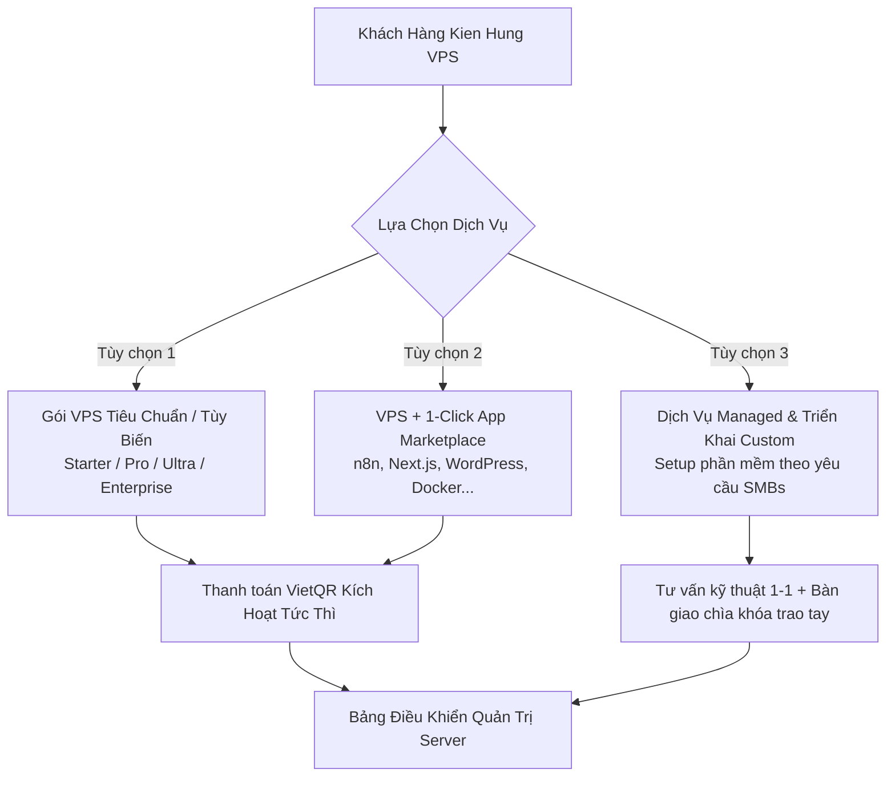

# 01. TỔNG QUAN DỰ ÁN (PROJECT OVERVIEW)

> **Tên dự án**: Kien Hung VPS (Hạ tầng Máy Chủ Ảo & Triển Khai Phần Mềm Trọn Gói)  
> **Đơn vị chủ quản**: CÔNG TY TNHH THƯƠNG MẠI VÀ PHÂN PHỐI KIẾN HƯNG  
> **Tài liệu**: Đặc tả tổng quan dự án, định vị thị trường, phân tích đối thủ & mô hình kinh doanh.

---

## 1. Giới Thiệu Doanh Nghiệp & Bối Cảnh Ra Đời

### 1.1. Pháp Lý Doanh Nghiệp
- **Tên công ty**: CÔNG TY TNHH THƯƠNG MẠI VÀ PHÂN PHỐI KIẾN HƯNG
- **Tên tiếng Anh**: KIEN HUNG DISTRIBUTION AND TRADING COMPANY LIMITED
- **Mã số thuế**: `3703344754`
- **Địa chỉ trụ sở**: Số 39/9, Đường Trần Hưng Đạo, Phường Đông Hòa, TP. Hồ Chí Minh, Việt Nam
- **Đại diện pháp luật**: Ông Đỗ Kiến Hưng – Giám đốc
- **Hotline**: 0976830911

### 1.2. Lý Do Hình Thành Dịch Vụ Kien Hung VPS
Trong kỷ nguyên chuyển đổi số và tự động hóa, nhu cầu sở hữu máy chủ riêng để chạy các ứng dụng kinh doanh, tự động hóa quy trình (n8n, Make), hệ thống thương mại điện tử, hosting website, chạy tool MMO/Marketing, và self-hosted các công cụ mã nguồn mở đang bùng nổ mạnh mẽ tại Việt Nam.

Tuy nhiên, hầu hết các dịch vụ VPS hiện nay trên thị trường tồn tại rào cản lớn:
1. **Người dùng không chuyên (Non-tech / Marketers / SMBs)**: Muốn dùng phần mềm (ví dụ WordPress, n8n, CRM) nhưng không biết cách cài đặt Linux, SSH, cấu hình Nginx, trỏ domain, cài chứng chỉ bảo mật SSL, hay thiết lập firewall.
2. **Nhà phát triển (Developers) & Startup nhỏ**: Tốn quá nhiều chi phí nếu thuê các nền tảng PaaS quốc tế (Vercel, Heroku, AWS) khi dự án lớn dần, nhưng lại mất thời gian nếu phải tự tay cấu hình máy chủ từ đầu mỗi lần dựng môi trường mới.
3. **Các nhà cung cấp truyền thống**: Chỉ bàn giao VPS "trắng" (hệ điều hành rỗng) hoặc cài sẵn các Control Panel nặng nề, thiếu tính hiện đại và tính linh hoạt.

**Kien Hung VPS** ra đời với sứ mệnh mang đến giải pháp **"Hạ Tầng Sẵn Sàng – Ứng Dụng Trong Tích Tắc"**, kết hợp hạ tầng máy chủ ảo tốc độ cao với các gói giải pháp phần mềm được đóng gói sẵn và dịch vụ kỹ thuật hỗ trợ tận nơi.

---

## 2. Phân Tích Nghiên Cứu Thị Trường (Market Research & Insights)

### 2.1. Ma Trận So Sánh Các Nền Tảng Hàng Đầu

| Tiêu chí | DigitalOcean / Vultr | Hetzner Cloud | Coolify / Dokploy (Self-hosted) | Nhà cung cấp VN (Vietnix, AZDIGI...) | **Kien Hung VPS (Mục tiêu)** |
|:---|:---|:---|:---|:---|:---|
| **Hiệu năng & Giá thành** | Tốt, thanh toán USD theo giờ | Cực rẻ/cấu hình cao, Data Center EU/US | Tùy thuộc VPS bạn gắn vào | Trung bình - Khá, gói theo tháng/năm | Tối ưu chi phí, phần cứng NVMe thế hệ mới |
| **Hỗ trợ phần mềm đi kèm** | Có Marketplace (tự quản trị) | Không (VPS trắng) | Rất nhiều template mã nguồn mở | Chủ yếu DirectAdmin, cPanel, CyberPanel | **1-Click App Catalog + Dịch vụ Setup riêng** |
| **Độ thân thiện UI/UX** | Rất cao, hiện đại | Tối giản, tập trung dev | Cực kỳ hiện đại, trực quan | Truyền thống (WHMCS), nhiều thao tác rườm rà | **Chuẩn Vibe Coding: Dark mode, Mượt, Tối giản (Next.js 16.3+)** |
| **Hỗ trợ & Ngôn ngữ tại VN**| Tiếng Anh, không hỗ trợ cài app hộ | Tiếng Anh, Support qua ticket chậm | Cộng đồng mở | Tiếng Việt qua hotline/ticket | **100% Tiếng Việt, CSKH đa kênh (Zalo/Hotline)** |
| **Thanh toán nội địa** | Thẻ Visa/Mastercard (phí ngoại tệ) | Thẻ tín dụng quốc tế / PayPal | Không áp dụng (phần mềm miễn phí) | Chuyển khoản, Momo, VNPAY | **VietQR tự động kích hoạt 60s, Momo** |

### 2.2. Insights Rút Ra Cho Kien Hung VPS
1. **UX Tối Giản Hóa Quyết Định Mua Hàng**: Khách hàng thích trải nghiệm trực quan với thanh kéo trượt cấu hình (CPU/RAM/SSD) và hiển thị tức thời giá thành, không cần đọc qua 20 bảng so sánh phức tạp.
2. **App Catalog Là Yếu Tố Khác Biệt Hóa (Differentiator)**: Thay vì chỉ bán "VPS 2 vCPU 4GB RAM", chúng tôi bán "Gói VPS Tối Ưu Cho n8n Automation", "Gói VPS Triển Khai Next.js Fullstack", "Gói VPS MMO Chống Checkpoint", "Gói WordPress Doanh Nghiệp Tốc Độ Cao".
3. **Thanh Toán Không Chờ Đợi**: Tích hợp quét mã QR VietQR tĩnh/động để máy chủ tự động khởi tạo ngay sau khi nhận tiền, không phải chờ nhân viên duyệt tay.

---

## 3. Định Vị Sản Phẩm & Phân Khúc Khách Hàng Mục Tiêu

### 3.1. Phân Khúc 1: Developers & Freelancers
- **Nhu cầu**: Muốn môi trường VPS sạch, có sẵn Docker/Docker-Compose, Node.js, Python, PostgreSQL/Redis, hoặc Coolify để host các ứng dụng cá nhân và dự án khách hàng.
- **Giá trị nhận được**: Khởi tạo nhanh, có sẵn template dev, tiết kiệm 70% chi phí so với PaaS nước ngoài.

### 3.2. Phân Khúc 2: Doanh Nghiệp Nhỏ (SMBs) & Agency
- **Nhu cầu**: Chạy website WordPress tốc độ cao, hệ thống CRM Mini, ERP, giải pháp Email doanh nghiệp, Web bán hàng.
- **Giá trị nhận được**: Được đội ngũ Kiến Hưng hỗ trợ cấu hình trọn gói, bảo mật SSL, tự động backup hàng ngày, xuất hóa đơn VAT đầy đủ.

### 3.3. Phân Khúc 3: Người Làm Tự Động Hóa (Automation / MMO / Creators)
- **Nhu cầu**: Chạy n8n, Make workflow, Telegram Bot, Crawler dữ liệu, proxy/VPN riêng tư.
- **Giá trị nhận được**: Template cài sẵn n8n với 1 cú click, không lo lỗi cài đặt môi trường.

---

## 4. Mô Hình Kinh Doanh & Dịch Vụ Cung Cấp

### 4.1. Các Dòng Sản Phẩm Cốt Lõi
1. **Cloud VPS Performance**: Dòng máy chủ ảo sử dụng 100% ổ cứng Enterprise NVMe U.2/U.3 siêu tốc, CPU thế hệ mới.
2. **App Stacks Ready**: VPS cài đặt sẵn các nền tảng phổ biến (Node.js, n8n, WordPress, Python FastAPI, Ghost, Docker...).
3. **Managed Services (Dịch vụ quản trị cộng thêm)**:
   - Dịch vụ tối ưu tốc độ website.
   - Dịch vụ chuyển dữ liệu (Migration) miễn phí từ nhà cung cấp khác sang Kiến Hưng.
   - Dịch vụ thiết lập bảo mật chuyên sâu và thiết lập hệ thống sao lưu dự phòng nhiều lớp.
