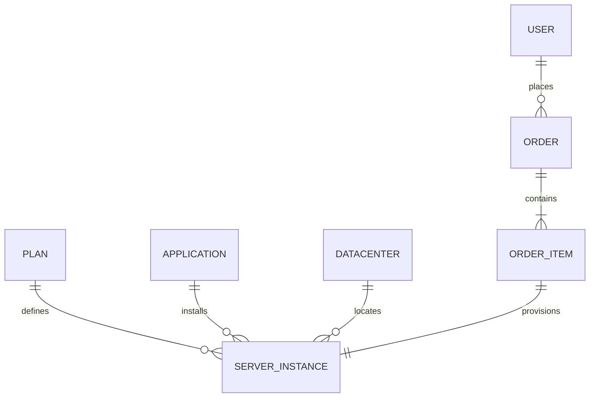
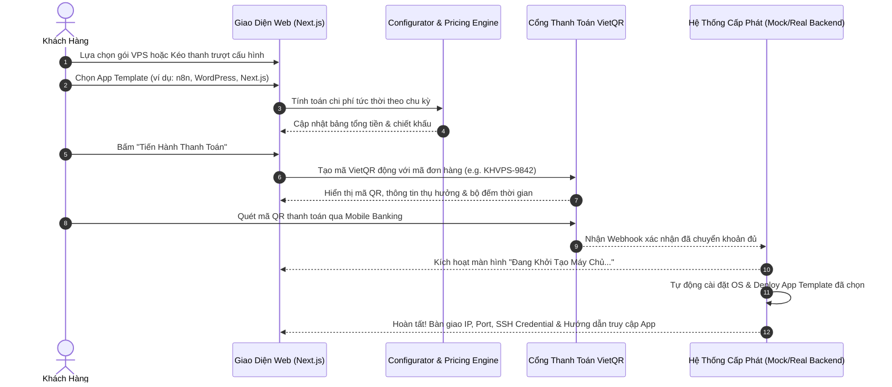

# 02. ĐẶC TẢ HỆ THỐNG & NGHIỆP VỤ (SYSTEM SPECIFICATIONS)

> **Dự án**: Kien Hung VPS  
> **Tài liệu**: Đặc tả mô hình dữ liệu (Data Models), công thức tính giá (Pricing Engine), luồng đặt hàng (Checkout Flow) và quy trình cấp phát máy chủ (Server Provisioning Lifecycle).

---

## 1. Mô Hình Dữ Liệu Cốt Lõi (Core Data Models)

Các mô hình dữ liệu được định nghĩa chuẩn hóa bằng TypeScript Types & Zod Schemas.



### 1.1. Gói Máy Chủ (VPS Plan Model)
```typescript
export interface VPSPlan {
  id: string;                    // e.g. "vps-starter", "vps-pro", "vps-ultra"
  name: string;                  // e.g. "Cloud VPS Pro"
  slug: string;                  // e.g. "pro"
  tagline: string;               // e.g. "Phù hợp cho dự án đang tăng trưởng & Web App"
  isPopular?: boolean;           // Badge "Khuyên Dùng"
  isCustom?: boolean;            // Dành cho gói thanh trượt tùy biến
  specs: {
    vCpu: number;                // Số Core CPU (e.g. 2, 4, 8)
    cpuType: string;             // e.g. "AMD EPYC™ Gen 4 / Intel Xeon Gold"
    ramGb: number;               // Dung lượng RAM tính theo GB (e.g. 4, 8, 16)
    diskGb: number;              // Dung lượng ổ cứng NVMe tính theo GB
    diskType: "NVMe Enterprise" | "SSD High IOPS";
    bandwidthTb: number;         // Băng thông (e.g. 2TB, Không giới hạn)
    ipv4Count: number;           // Số lượng IPv4 tĩnh (mặc định: 1)
    portSpeedGbps: number;       // Tốc độ cổng mạng (e.g. 1Gbps, 10Gbps)
  };
  pricing: {
    monthlyVnd: number;          // Giá theo tháng (e.g. 150000)
    yearlyVnd: number;           // Giá theo năm (có chiết khấu, e.g. 1440000)
    discountPercentYearly: number; // e.g. 20%
  };
  features: string[];            // Danh sách gạch đầu dòng tính năng
}
```

### 1.2. Ứng Dụng Đóng Gói Kèm Theo (App Template Model)
```typescript
export interface AppTemplate {
  id: string;                    // e.g. "app-n8n", "app-nextjs", "app-wordpress"
  name: string;                  // e.g. "n8n Workflow Automation"
  category: "automation" | "web-framework" | "cms" | "database" | "devops" | "ai-tools";
  iconUrl?: string;              // Icon định dạng SVG
  iconName: string;              // Lucide icon name fallback
  version: string;               // e.g. "1.74.0"
  tagline: string;               // e.g. "Nền tảng tự động hóa quy trình không giới hạn"
  description: string;           // Mô tả chi tiết tính năng
  includedStack: string[];       // e.g. ["Docker", "Caddy Reverse Proxy", "PostgreSQL", "Auto SSL"]
  minimumSpecs: {
    minCpu: number;              // Số vCPU tối thiểu đề xuất
    minRamGb: number;            // RAM tối thiểu (GB)
    minDiskGb: number;           // Ổ cứng tối thiểu (GB)
  };
  setupType: "free-1click" | "managed-pro"; // 1-Click tự động hoặc Kỹ thuật viên setup chuyên sâu
  setupPriceVnd: number;         // 0đ nếu là free-1click, phí phụ thu nếu có managed service
}
```

### 1.3. Vị Trí Trung Tâm Dữ Liệu (Datacenter Location)
```typescript
export interface DatacenterLocation {
  id: string;                    // e.g. "vn-hcm", "vn-hn", "sg-sin"
  name: string;                  // e.g. "Hồ Chí Minh - VNPT IDC Tier 3"
  city: string;
  country: string;
  countryCode: "VN" | "SG" | "JP";
  latencyMsEstimate: number;     // e.g. 5ms (trong nước)
  status: "available" | "limited" | "maintenance";
}
```

### 1.4. Đơn Hàng & Cấu Hình Máy Chủ (Order & Instance Model)
```typescript
export interface ServerConfigurationState {
  planId: string;
  isCustomSpec: boolean;
  customSpecs?: {
    vCpu: number;
    ramGb: number;
    diskGb: number;
  };
  billingCycle: "1_month" | "3_months" | "6_months" | "12_months" | "24_months";
  os: {
    distro: "ubuntu" | "debian" | "centos" | "almalinux" | "windows-server";
    version: string;
  };
  selectedAppId?: string;        // ID phần mềm 1-click đính kèm
  datacenterId: string;
  hostname: string;
  sshKeyOrPassword: string;
  backupAddon: boolean;
  extraIpv4Count: number;
  managedSupportAddon: boolean;
}

export interface OrderCalculationResult {
  basePriceVnd: number;
  appSetupPriceVnd: number;
  backupAddonPriceVnd: number;
  extraIpv4PriceVnd: number;
  managedSupportPriceVnd: number;
  subtotalVnd: number;
  discountVnd: number;
  vatVnd: number;                // Thuế VAT 8% hoặc 10% nếu xuất hóa đơn
  totalAmountVnd: number;
  formattedTotalVnd: string;
}
```

---

## 2. Công Thức Tính Giá Cấu Hình Tùy Biến (Custom Configurator Engine)

Để phục vụ thanh trượt tùy biến linh hoạt tại trang chủ và trang đặt hàng, công thức tính giá theo đơn vị tài nguyên được quy định:

| Tài nguyên | Đơn vị tính | Đơn giá cơ sở / tháng | Giới hạn Min - Max |
|:---|:---|:---|:---|
| **vCPU (AMD/Intel Core)** | 1 Core | 50.000 VNĐ | 1 – 32 Cores |
| **RAM DDR4/DDR5 ECC** | 1 GB | 35.000 VNĐ | 1 – 64 GB |
| **NVMe Enterprise Storage** | 10 GB | 20.000 VNĐ | 20 – 1.000 GB |
| **IPv4 Tĩnh Bổ Sung** | 1 IP | 80.000 VNĐ | 0 – 5 IPs |
| **Gói Sao Lưu Tự Động (Auto-Backup)** | Gói | 15% tổng giá trị VPS | Bật / Tắt |
| **Dịch Vụ Managed Kỹ Thuật 24/7** | Gói hỗ trợ | 200.000 VNĐ / tháng | Bật / Tắt |

### Chính Sách Chiết Khấu Theo Chu Kỳ Thanh Toán:
- **1 Tháng**: Không chiết khấu (100% giá gốc).
- **3 Tháng**: Giảm 5%.
- **6 Tháng**: Giảm 10%.
- **12 Tháng (1 Năm)**: **Giảm 20%** + Tặng 1 tháng sử dụng.
- **24 Tháng (2 Năm)**: **Giảm 30%** + Miễn phí khởi tạo ứng dụng cao cấp.

---

## 3. Luồng Đặt Hàng & Cấp Phát Máy Chủ (Provisioning Lifecycle)



---

## 4. Đặc Tả Bảng Điều Khiển Giả Lập Mẫu (Mock Dashboard Preview)

Để người dùng trải nghiệm trước chất lượng và sự mượt mà của hệ thống quản trị, frontend MVP sẽ tích hợp giao diện Dashboard Preview sống động:
1. **Chỉ số thời gian thực (Live Metrics)**: Biểu đồ CPU load (%), RAM usage (GB/Total), Disk I/O, và Lưu lượng mạng In/Out với chuyển động động lực học.
2. **Thanh công cụ điều khiển (Quick Controls)**:
   - Nút Power ON / Reboot / Graceful Shutdown kèm Modal cảnh báo.
   - Nút **"Truy Cập Ứng Dụng Ngay"** (mở URL trực tiếp đến n8n / WordPress / Web App vừa deploy).
   - Nút **"Web Console / SSH Terminal"** giao diện dòng lệnh đen trắng mô phỏng kết nối server.
   - Lịch sử sao lưu và nút bấm "Tạo bản sao lưu tức thì (Snapshot)".
