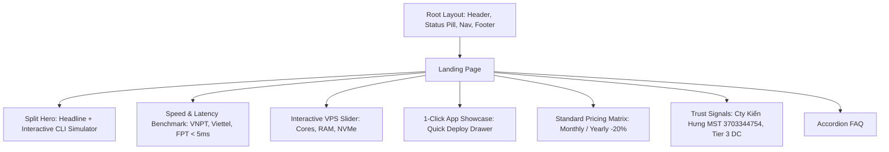

# 03. KIẾN TRÚC FRONTEND & THIẾT KẾ GIAO DIỆN (FRONTEND ARCHITECTURE)

> **Dự án**: TrioHAT-VPS  
> **Thuộc**: CÔNG TY TNHH THƯƠNG MẠI VÀ PHÂN PHỐI KIẾN HƯNG (MST: 3703344754)  
> **Phiên bản**: Refactor Release (Developer Cloud Platform Standard)

---

## 1. Triết Lý Thiết Kế & Trải Nghiệm Người Dùng (Developer-First Cloud Platform)

Giao diện của **TrioHAT-VPS** được xây dựng theo triết lý **Developer-First Infrastructure**, lấy cảm hứng từ các nền tảng điện toán đám mây và công cụ developer hàng đầu thế giới (Railway, Supabase, Vercel, Hetzner Console), tuân thủ tiêu chuẩn **UI/UX Pro Max**:

### 1.1. Bảng Màu & Design Tokens
- **Nền chính (Root Background)**: `#080C14` — Deep Dark OLED, triệt tiêu ánh sáng chói, tạo độ sâu chuyên nghiệp.
- **Bề mặt & Card (Surface/Card)**: `#0F172A` với viền `1px solid rgba(255,255,255,0.08)`, hover viền xanh Emerald `#10B981`.
- **Màu điểm nhấn (Accents)**:
  - **Emerald Engine (`#10B981`)**: Biểu thị hệ thống Online, Uptime 99.9%, CTA chính, Giao dịch thành công.
  - **Cyan IOPS (`#06B6D4`)**: Biểu thị tốc độ NVMe, Lệnh Terminal, Network In/Out.
  - **Amber (`#F59E0B`)**: Nhãn phổ biến nhất (Best Seller), Cảnh báo tài nguyên, Sao lưu tự động.
- **Typography**:
  - `Space Grotesk`: Tiêu đề Display, Chỉ số giá tiền, Thông số kỹ thuật CPU/RAM lớn.
  - `DM Sans`: Nội dung, văn bản đọc, form labels tiếng Việt tối ưu.
  - `Fira Code`: Lệnh SSH, IP Address, JSON configuration, Terminal logs.

---

## 2. Cấu Trúc Thành Phần Giao Diện (Component Hierarchy)

---

## 3. Danh Sách Các Trang & Tính Năng Cốt Lõi

### 3.1. Trang Chủ (`/` — `src/app/page.tsx`)
- **Split Hero**: Value proposition dứt khoát kết hợp **Interactive CLI Simulator** cho phép gõ hoặc click chuyển preset để xem ngay giá và câu lệnh `curl / docker run` tương ứng.
- **Latency Benchmark**: Thước đo độ trễ mạng thực tế từ các ISP lớn tại Việt Nam.
- **Trust & Legal**: Minh bạch thông tin Công ty Kiến Hưng, cam kết SLA 99.9%, hỗ trợ hóa đơn VAT điện tử.

### 3.2. Bộ Tùy Biến Cấu Hình VPS (`/configure` — `src/app/configure/page.tsx`)
- **Visual Hardware Rig**: Thanh trượt / nút chọn nhanh vCPU, RAM ECC, SSD NVMe Gen4.
- **Add-ons Selector**: Danh mục Auto-backup, DDoS Protection, Cloudflare CDN, Support Premium (đã fix type `as const`).
- **Sticky Price Summary**: Bảng kê chi phí thời gian thực kèm tính toán giảm giá 20% chu kỳ 1 năm.

### 3.3. Kho Ứng Dụng 1-Click (`/apps` — `src/app/apps/page.tsx`)
- Phân loại danh mục: `Automation & AI`, `Web & App Dev`, `CMS & E-commerce`, `DevOps & Database`.
- **App Card**: Hiển thị Stack kỹ thuật và Yêu cầu cấu hình tối thiểu.
- **Quick Deploy Drawer**: Drawer thông tin cổng mặc định và liên kết trực tiếp sang trang cấu hình.

### 3.4. Bảng Giá Chuẩn (`/pricing` — `src/app/pricing/page.tsx`)
- 4 Tier: Starter, Basic, Professional (LED Accent), Enterprise.
- Toggle chu kỳ thanh toán (Theo tháng / Theo năm - Tiết kiệm 20%).
- Bảng Feature Comparison Matrix toàn diện.

### 3.5. Luồng Thanh Toán & Cấp Phát (`/checkout` — `src/app/checkout/page.tsx`)
- Form thông tin khách hàng kèm validation Zod.
- Khung VietQR QuickLink kèm nút 1-click Copy (STK, Số tiền, Mã hóa đơn) có Toast feedback.
- Live Provisioning Simulator (Animation 4 bước kích hoạt server trong 3 giây).

### 3.6. Bảng Điều Khiển Console (`/dashboard` — `src/app/dashboard/page.tsx`)
- Console Header với nút Copy SSH 1-Click (`ssh root@103.xxx.xxx.xxx`).
- Gauge Usage Meters đo CPU, RAM, Disk IOPS, Network.
- Activity Feed dạng Terminal Log thời gian thực.
- Quick Actions: Restart, Power Toggle, Snapshot với modal an toàn.
