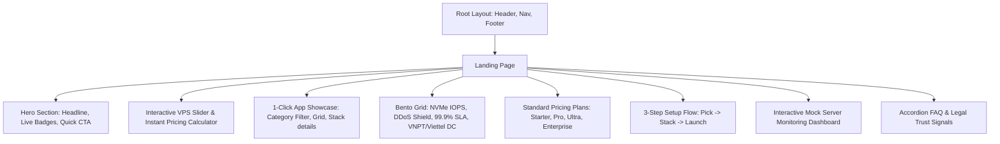

# 03. KIẾN TRÚC FRONTEND & THIẾT KẾ GIAO DIỆN (FRONTEND ARCHITECTURE)

> **Dự án**: TrioHAT-VPS  
> **Tài liệu**: Kiến trúc ứng dụng Frontend, Hệ thống Design System "Vibe Coding", Quy chuẩn Component & Quản lý State.

---

## 1. Triết Lý Thiết Kế & Trải Nghiệm Người Dùng ("Vibe Coding" Aesthetics)

Giao diện của **TrioHAT-VPS** hướng tới đẳng cấp quốc tế, hiện đại, mang hơi thở của các sản phẩm công nghệ hàng đầu như Vercel, Supabase, Linear, Raycast và Railway.

### 1.1. Bảng Màu & Design Tokens (Color Palette - Tailwind CSS v4)
- **Cấu hình CSS-First (Tailwind v4)**: Sử dụng `@import "tailwindcss";` kết hợp `@theme inline` với các biến CSS hiện đại (OKLCH / HSL).
- **Nền chính (Background)**: Deep Space Black (`#050811` / `zinc-950`) kết hợp các hiệu ứng ánh sáng tỏa (Radial Gradient Mesh glow).
- **Màu thẻ & Container (Surface/Cards)**: `zinc-900/60` với kính mờ `backdrop-blur-xl`, viền mảnh `border border-white/10` phản quang khi hover.
- **Màu điểm nhấn (Accents & Highlights)**:
  - **Electric Cyan (`#06b6d4` / `#22d3ee`)**: Tượng trưng cho tốc độ ánh sáng, lưu lượng mạng và độ trễ thấp.
  - **Neon Indigo/Violet (`#6366f1` / `#8b5cf6`)**: Tượng trưng cho trí tuệ nhân tạo, tự động hóa và hạ tầng điện toán đám mây.
  - **Emerald Green (`#10b981`)**: Tượng trưng cho trạng thái máy chủ Online (99.9% Uptime) và giao dịch thành công.
- **Typography**: Phông chữ hình học hiện đại không chân (Inter, Plus Jakarta Sans, Outfit hoặc Geist Sans) hỗ trợ hiển thị sắc nét tiếng Việt có dấu.

### 1.2. Hiệu Ứng Chuyển Động & Micro-interactions (Motion / React 19)
- **Thư viện chuyển động**: Sử dụng package mới nhất **`motion`** (import từ `motion/react`, tiền thân là `framer-motion`), tối ưu hoàn hảo cho React 19.
- **Glow & Border Tracing**: Thẻ card có viền phát sáng nhẹ theo chuyển động chuột hoặc hiệu ứng pulse tinh tế.
- **Dynamic Number Counter**: Khi người dùng kéo thanh trượt CPU/RAM, số tiền và thông số cấu hình nhảy mượt mà bằng transition toán học.
- **Live Status Pulsing**: Đèn LED xanh trạng thái nhấp nháy tạo cảm giác hệ thống máy chủ đang hoạt động trực tiếp (Alive & Responsive).

---

## 2. Cấu Trúc Các Trang & Luồng Điều Hướng (Next.js 16.3+ App Router)

> **Lưu ý quan trọng**: Next.js 16 uses `proxy.ts` thay vì `middleware.ts`. Tailwind CSS v4 uses CSS-first config (không `tailwind.config.ts`). React 19.2 với View Transitions và `useActionState`.

```
src/
├── app/
│   ├── (marketing)/
│   │   ├── page.tsx                  # Landing Page chính (Hero, Slider, Apps, Bento, Pricing, FAQ)
│   │   ├── pricing/page.tsx          # Bảng giá tổng thể & công cụ so sánh chi tiết
│   │   ├── apps/page.tsx             # Trang Marketplace khám phá 15+ ứng dụng 1-click
│   │   └── solutions/                # Các trang landing theo nhu cầu đặc thù (MMO, SMB, Agency)
│   ├── configure/page.tsx            # Trình tùy biến cấu hình VPS & chọn App Stack đính kèm
│   ├── checkout/page.tsx             # Màn hình thanh toán đơn hàng & mã VietQR động
│   ├── dashboard-preview/page.tsx    # Giao diện trải nghiệm trực quan Control Panel quản trị VPS
│   ├── layout.tsx                    # Header, Navbar, Mobile Menu, Footer toàn trang
│   └── globals.css                   # Tailwind v4 CSS-first (@import "tailwindcss"; @theme inline)
├── proxy.ts                          # Next.js 16 Network Boundary & Routing Guard (thay middleware.ts)
```

---

## 3. Phân Rã Thành Phần Giao Diện (Component Hierarchy)



### 3.1. Thư Viện UI Component Bổ Sung

Bên cạnh Shadcn UI + Radix primitives (đã định nghĩa trong Hiến pháp), dự án sử dụng thêm:

- **Glasscn-UI**: Các biến thể glassmorphism (backdrop-blur, frost, shimmer) được tùy chỉnh sẵn, tích hợp trực tiếp vào hệ thống design tokens CSS-first của Tailwind v4.
- **Magic UI**: Thư viện 150+ animated components (particles, beam effects, globe, marquee, code comparison, zoomable image,_scrubber...) hỗ trợ hiệu ứng thị giác cao cấp cho Hero Section, Bento Grid và Dashboard Mock.

### 3.2. Các Component Trọng Tâm Của Giai Đoạn MVP

#### A. Component `InteractiveConfigurator` (`@/components/features/configurator/`)
- Cho phép người dùng kéo 3 thanh trượt độc lập:
  - **vCPU Cores**: 1 Core ➔ 32 Cores.
  - **RAM Memory**: 1 GB ➔ 64 GB.
  - **NVMe Storage**: 20 GB ➔ 1.000 GB.
- Lựa chọn Datacenter (TP. HCM, Hà Nội, Singapore).
- Lựa chọn Hệ điều hành (Ubuntu 24.04, Debian 12, Windows Server...).
- Nút chuyển đổi chu kỳ thanh toán: 1 tháng / 6 tháng (giảm 10%) / 1 năm (giảm 20% + tặng 1 tháng).
- Hiển thị giá tức thời theo tháng và theo năm đã giảm trừ chiết khấu.

#### B. Component `AppCatalogGrid` (`@/components/features/app-catalog/`)
- Thanh lọc danh mục theo Tabs: `Tất Cả`, `Tự Động Hóa (n8n, Bot)`, `Web Stacks (Next.js, Node, Python)`, `CMS & E-commerce (WordPress)`, `Hạ Tầng & DevOps (Docker, Coolify, Database)`.
- Thẻ Card Ứng Dụng (App Card):
  - Logo chính thức / Icon sắc nét.
  - Tag phân loại + Phiên bản mới nhất.
  - Mô tả ngắn gọn lợi ích.
  - Các công nghệ đi kèm sẵn (ví dụ: `Docker + Caddy + Auto SSL + Redis`).
  - Nút **"Chọn Triển Khai Gói Này"** (Tự động đưa vào cấu hình đơn hàng).

#### C. Component `VietQRCheckoutModal` (`@/components/features/checkout/`)
- Tích hợp **VietQR QuickLink API** (`https://img.vietqr.io/image/<BANK_ID>-<ACCOUNT_NO>-compact2.png?amount=<AMOUNT>&addInfo=<ORDER_CODE>&accountName=<NAME>`), sinh mã QR động trực tiếp mà không cần phụ thuộc thư viện cồng kềnh.
- Bộ đếm thời gian giữ đơn hàng (15:00 đếm ngược).
- Nút bấm copy 1-chạm (Số tài khoản, Số tiền, Nội dung chuyển khoản mã hóa đơn `KHVPS-XXXX`).
- Nút mô phỏng "Xác Nhận Đã Chuyển Khoản" (kích hoạt webhook giả lập và animation cấp phát máy chủ thành công trong 3 giây).

#### D. Component `LiveDashboardMock` (`@/components/features/dashboard-mock/`)
- Giao diện giả lập trung thực của bảng quản trị VPS:
  - Tên máy chủ: `vps-sg-prod-01.example.com`.
  - IP Public: `103.142.26.88`.
  - Trạng thái: `Running 🟢 (Uptime: 14 ngày 6 giờ)`.
  - Đồng hồ đo CPU Load (% biểu đồ nhịp tim thời gian thực).
  - Thanh tiến trình RAM Usage (e.g. 3.2 GB / 8.0 GB).
  - Bảng điều khiển Console mô phỏng thao tác SSH lệnh.

---

## 4. Quản Lý State (State Management Architecture)

Sử dụng **Zustand** cho Client State toàn cục:

```typescript
// store/useVPSStore.ts
import { create } from 'zustand';
import { VPSPlan, AppTemplate, ServerConfigurationState } from '@/types';

interface VPSStoreState {
  // Cấu hình hiện tại
  config: ServerConfigurationState;
  selectedPlan: VPSPlan | null;
  selectedApp: AppTemplate | null;
  
  // Actions
  setPlan: (plan: VPSPlan) => void;
  setCustomSpecs: (specs: { vCpu: number; ramGb: number; diskGb: number }) => void;
  setBillingCycle: (cycle: ServerConfigurationState['billingCycle']) => void;
  setSelectedApp: (app: AppTemplate | null) => void;
  setDatacenter: (dcId: string) => void;
  setOS: (distro: string, version: string) => void;
  toggleBackup: () => void;
  toggleManagedSupport: () => void;
  resetConfig: () => void;
}
```

---

## 5. Tối Ưu Hóa Hiệu Năng & SEO (Best Practices)
1. **Lighthouse Score 95+**:
   - Sử dụng React Server Components cho tất cả nội dung tĩnh.
   - Tối ưu Font với `next/font/google` (tự động inline CSS và giảm thiểu layout shift).
   - Tối ưu ảnh với định dạng WebP/AVIF và component `next/image`.
2. **SEO Metadata Hoàn Chỉnh**:
   - Khai báo đầy đủ OpenGraph, Twitter Cards, Schema.org JSON-LD (Product, Organization, Service).
   - Khai báo thông tin pháp lý doanh nghiệp minh bạch giúp tăng điểm uy tín với các công cụ tìm kiếm và đối tác thanh toán.
