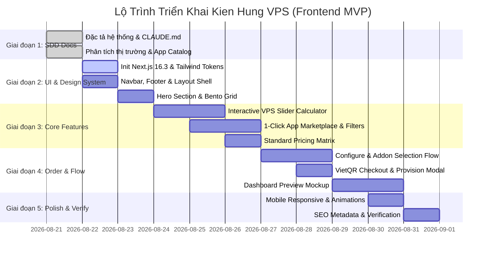

# 05. LỘ TRÌNH TRIỂN KHAI MVP & KẾ HOẠCH PHÁT TRIỂN (MVP ROADMAP)

> **Dự án**: Kien Hung VPS  
> **Tài liệu**: Kế hoạch chia kỳ phát triển (Phases), các mốc bàn giao (Milestones) và tiêu chí nghiệm thu cho giai đoạn MVP Frontend.

---

## 1. Mục Tiêu Giai Đoạn MVP (MVP Core Goals)

Mục tiêu trọng tâm của giai đoạn MVP là hoàn thiện một **Giao Diện Frontend & Trải Nghiệm Khách Hàng Xuất Sắc** ("Vibe Coding" Level) với đầy đủ tính năng:
1. Giới thiệu sản phẩm với thiết kế tối tân (Dark mode, visual animations, trust signals công ty Kiến Hưng).
2. Công cụ tùy biến cấu hình máy chủ & tính giá tức thì (Interactive VPS Configurator & Instant Price Calculator).
3. Kho ứng dụng 1-Click hiển thị đầy đủ 15+ ứng dụng với bộ lọc thông minh.
4. Luồng cấu hình đơn hàng và thanh toán VietQR động mô phỏng chân thực.
5. Trang trải nghiệm Bảng điều khiển quản trị máy chủ (Mock Control Panel Preview) tương tác cao.

---

## 2. Các Giai Đoạn Triển Khai (Development Milestones)

---

## 3. Chi Tiết Các Hạng Mục Deliverables Cho MVP Frontend

### Phase 1: Core Layout & Landing Showcase
- [x] **Tài liệu đặc tả SDD**: Hoàn thành `CLAUDE.md`, `README.md`, và 5 tài liệu trong `docs/`.
- [ ] **Root Layout**: Header với Logo Kiến Hưng Cloud/VPS, Navigation Links (Gói VPS, Ứng Dụng, Bảng Giá, Giải Pháp, Về Chúng Tôi), Nút CTA "Dùng Thử Ngay / Đặt Máy Chủ".
- [ ] **Footer**: Thông tin pháp lý (CÔNG TY TNHH THƯƠNG MẠI VÀ PHÂN PHỐI KIẾN HƯNG, MST: `3703344754`, Địa chỉ TP. HCM, Hotline, Chính sách dịch vụ, SLA cam kết).
- [ ] **Hero Section**: Hiệu ứng Gradient Glow, Dynamic Badge "Hạ Tầng NVMe Thế Hệ Mới - Kích Hoạt Trong 60s", Tiêu đề ấn tượng, Nút tương tác chuyển đổi nhanh.
- [ ] **Bento Grid Features**: Thẻ thông tin trực quan về Tốc độ NVMe Gen 4, Bảo vệ DDoS đa tầng, Uptime 99.9%, Hỗ trợ 24/7.

### Phase 2: Interactive Configurator & App Catalog
- [ ] **Bộ Tùy Biến Cấu Hình Máy Chủ (Configurator)**:
  - Thanh trượt vCPU, RAM, NVMe SSD mượt mà.
  - Bộ tính toán giá VND tức thì, áp dụng giảm giá 20% khi chọn chu kỳ 1 năm.
  - Chọn Datacenter (TP. HCM, Hà Nội, Singapore).
- [ ] **Kho Ứng Dụng 1-Click (App Catalog Showcase)**:
  - Danh sách 15+ ứng dụng: n8n, Next.js, WordPress, CyberPanel, Docker, Python FastAPI, WireGuard, v.v.
  - Phân loại danh mục tab linh hoạt (Automation, Web Dev, CMS, DevOps, AI).
  - Modal xem chi tiết thông số và stack đi kèm của từng ứng dụng.

### Phase 3: Luồng Đặt Hàng & Thanh Toán VietQR
- [ ] **Trang Cấu Hình Đơn Hàng (`/configure`)**:
  - Xem lại thông số gói đã chọn hoặc cấu hình tùy biến.
  - Lựa chọn Hệ điều hành (Ubuntu, Debian, CentOS, Windows).
  - Tùy chọn bổ sung (Auto Backup +15%, IP Tĩnh bổ sung, Managed Service).
- [ ] **Trang Thanh Toán VietQR (`/checkout`)**:
  - Tóm tắt chi tiết hóa đơn (Tạm tính, Giảm giá, VAT nếu có, Tổng thanh toán).
  - Mã VietQR động kèm thông tin chuyển khoản chính xác và mã đơn hàng `KHVPS-XXXX`.
  - Bộ đếm ngược thời gian và nút xác nhận mô phỏng đã thanh toán.
  - Animation cấp phát máy chủ thành công trong 3 giây.

### Phase 4: Mock Dashboard Quản Trị Server (`/dashboard-preview`)
- [ ] Màn hình giả lập Server Overview:
  - Thông số IP, Hệ điều hành, Vị trí Datacenter, Trạng thái Uptime.
  - Biểu đồ thời gian thực: CPU Load %, RAM Usage, Disk Read/Write IOPS, Network Traffic In/Out.
  - Quick Action Buttons: Khởi động lại, Tắt nguồn, Xem SSH Info, Tạo Snapshot.

---

## 4. Kế Hoạch Cho Các Giai Đoạn Tiếp Theo (Post-MVP Roadmap)

### Giai đoạn 2 (Backend & Automation Integration):
- Tích hợp API hạ tầng máy chủ ảo thực tế (Proxmox VE / OpenStack / KVM / Hetzner Cloud API / DigitalOcean API).
- Tích hợp Webhook thanh toán VietQR tự động (SePay / Casso / PayOS / Ngân hàng nội địa).
- Hệ thống xác thực người dùng (NextAuth.js / Supabase Auth / Clerk) và Quản lý hóa đơn VAT điện tử.

### Giai đoạn 3 (Enterprise & Advanced PaaS):
- Bổ sung tính năng Multi-server Cluster, Load Balancer tự động.
- Nâng cấp kho ứng dụng AI Agent Stacks (Ollama, vLLM, Open-WebUI, Flowise).
- Chương trình Đại lý & Tiếp thị liên kết (Affiliate Program).
